### Project requirements

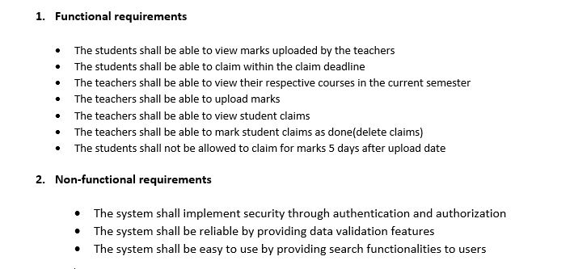

### Database diagram

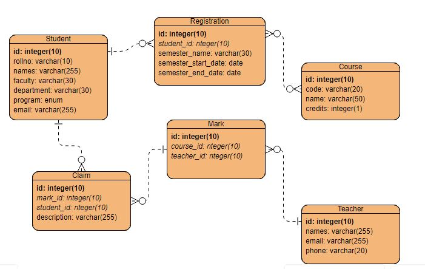

### User documentation

#### A. From student’s perspective

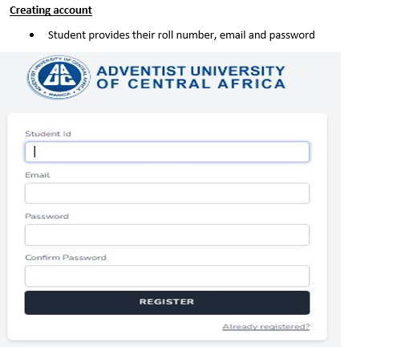

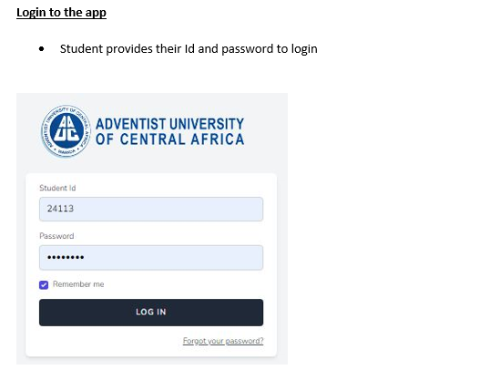

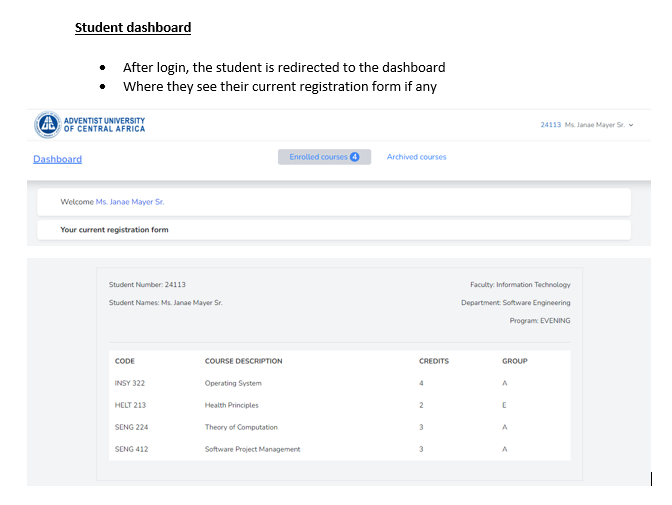

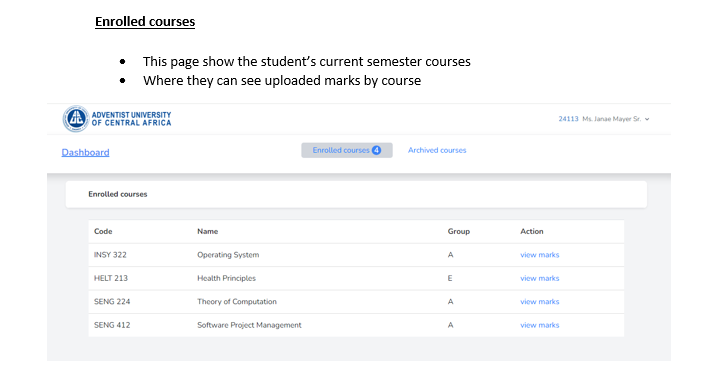

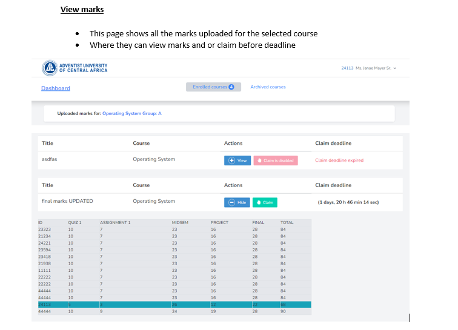

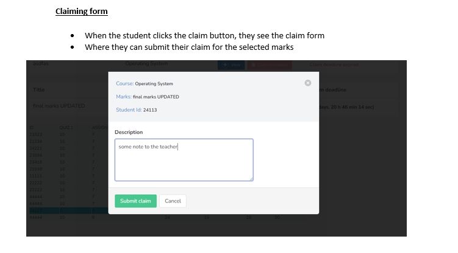

#### B. From teacher’s perspective

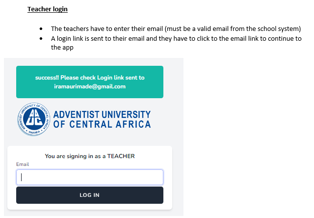

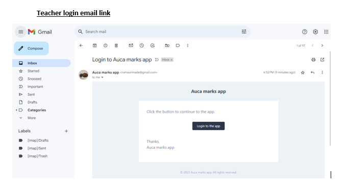

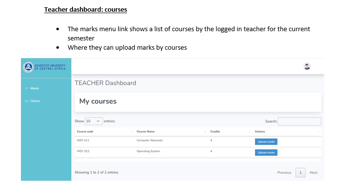

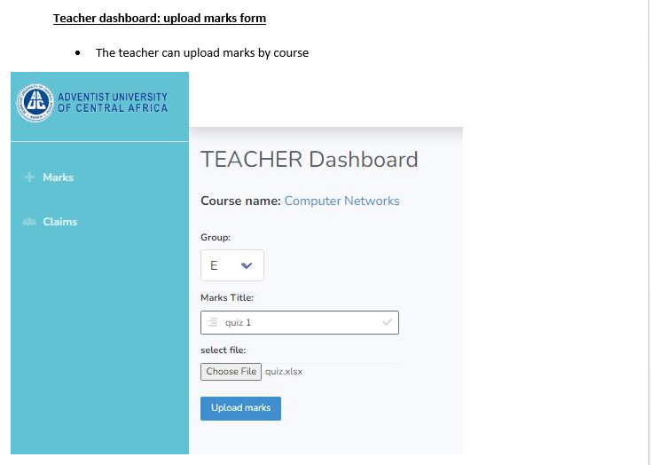

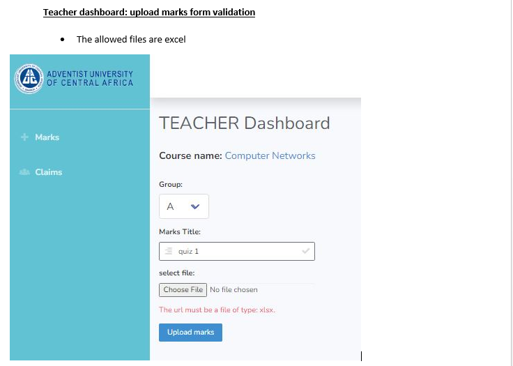

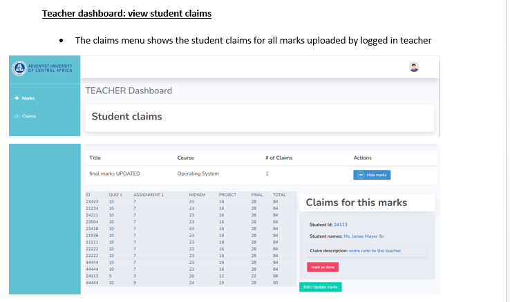

### Technologies / Tools used

```bash
2 laravel apps
one acting as an api - simulates the auca registation (github link: https://github.com/IrakozeMaurice/auca-registration-api)
onother acting as the main app - retrieves all information needed from the api
```

```bash
php
laravel
tailwind css
mysql
vanilla js
axios
```
